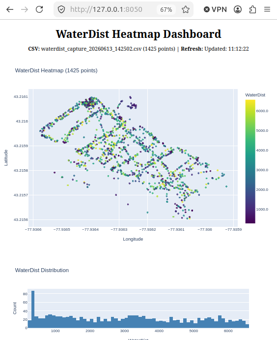

# MAVLink WaterDist Capture

Capture MAVLink data from QGroundControl and log WaterDist sensor readings with GPS coordinates with ```capture.py```.  Visualize incoming waterdist data in realtime with ```visualize.py```.

## Creativity on the Canal June 13th, 2026 data
Included is a .csv file of the data captured during the creativity on the canal festival in Brockport, NY.



## Setup

```bash
python3 -m venv .venv
source .venv/bin/activate
pip install pymavlink dash numpy
```

## Capture Data

```bash
python3 capture.py
```

- Connects to QGroundControl on `127.0.0.1:14445` (UDPM mode)
- Writes each WaterDist reading with timestamp and GPS coords to a CSV file
- CSV files are named `waterdist_capture_YYYYMMDD_HHMMSS.csv`
- Press Ctrl+C to stop

## Visualize (Real-time Dashboard)

```bash
python3 visualize.py
```

- Opens a web dashboard at http://127.0.0.1:8050
- Auto-refreshes every 3 seconds as new CSV data arrives
- Shows a scatter plot of WaterDist values by GPS position
- Shows a WaterDist distribution histogram
